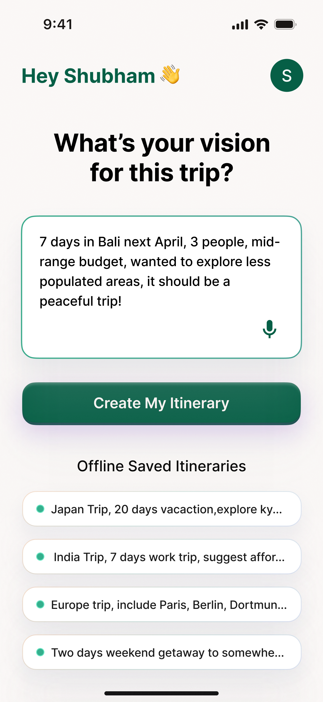
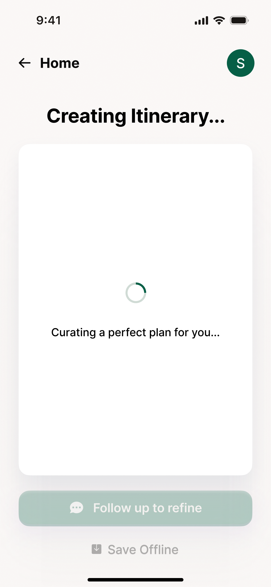
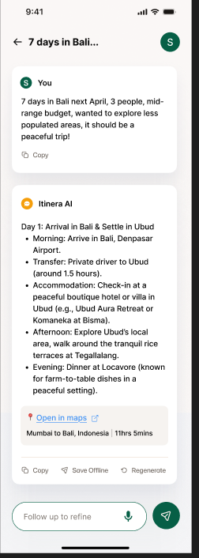
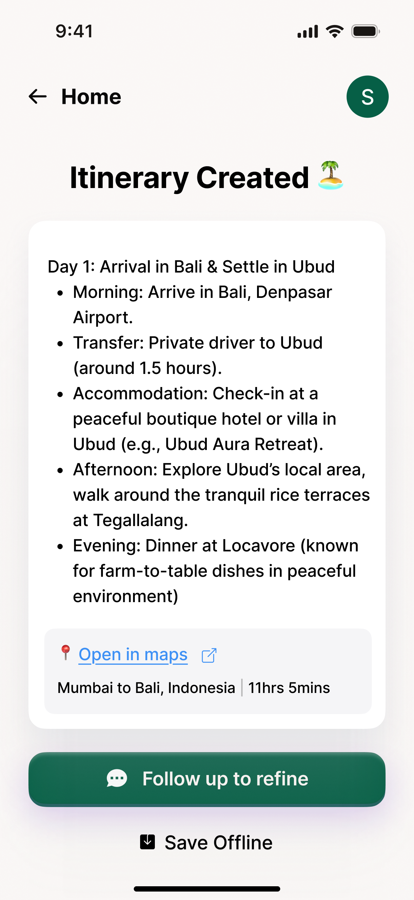
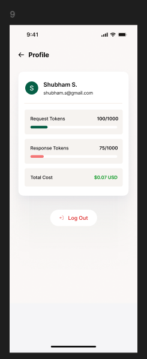
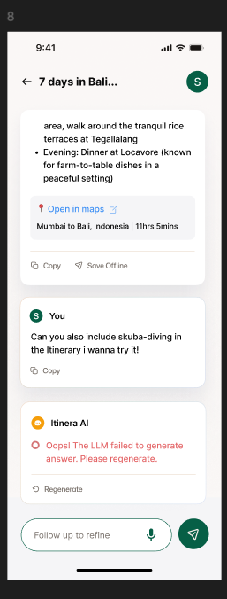

# Itinera AI 🧳✈️

An AI-powered travel itinerary planning app built with Flutter, featuring intelligent trip generation, real-time refinement, and seamless user experience.

## 🚀 Features

- **AI-Powered Itinerary Generation**: Uses Google Gemini AI to create detailed travel plans
- **Real-time Refinement**: Chat-like interface for customizing itineraries
- **Speech-to-Text**: Voice input for hands-free trip planning
- **Offline Support**: Save and access itineraries without internet
- **Maps Integration**: Direct integration with Google Maps/Apple Maps
- **Authentication**: Firebase Auth with Google Sign-In and email/password
- **Modern UI**: Beautiful, responsive design with smooth animations

## 🛠️ Setup

### Prerequisites

- Flutter SDK (>=3.3.0)
- Dart SDK
- Android Studio / Xcode
- Firebase project
- Google Cloud Console project

### Installation

1. **Clone the repository**
   ```bash
   git clone https://github.com/yourusername/itinera_ai.git
   cd itinera_ai
   ```

2. **Install Flutter dependencies**
   ```bash
   flutter pub get
   ```

3. **Install system dependencies (macOS)**
   ```bash
   # Install Homebrew (if not already installed)
   /bin/bash -c "$(curl -fsSL https://raw.githubusercontent.com/Homebrew/install/HEAD/install.sh)"
   
   # Install required tools
   brew install --cask flutter
   brew install --cask android-studio
   brew install cocoapods
   ```

4. **Firebase Setup**
   ```bash
   # Install Firebase CLI
   npm install -g firebase-tools
   
   # Login to Firebase
   firebase login
   
   # Configure Firebase for Flutter
   flutterfire configure
   
   # Select your Firebase project
   # Choose platforms: Android, iOS, Web
   # Follow the prompts to configure each platform
   ```

5. **Configure API Keys**
   - Get your Google Gemini API key from [Google AI Studio](https://makersuite.google.com/app/apikey)
   - Update the API key in:
     - `lib/services/gemini_service.dart` (line 5)
     - `lib/screen/follow_up_refinement/bloc/follow_up_refinement_bloc.dart` (line 225)
     - `lib/screen/itinerary_process/bloc/itinerary_process_bloc.dart` (line 225)

6. **Android Configuration**
   ```bash
   # Add to android/app/src/main/AndroidManifest.xml
   <uses-permission android:name="android.permission.RECORD_AUDIO" />
   <uses-permission android:name="android.permission.INTERNET" />
   ```

7. **iOS Configuration**
   ```bash
   # Add to ios/Runner/Info.plist
   <key>NSMicrophoneUsageDescription</key>
   <string>This app needs microphone access for speech recognition</string>
   ```

8. **Run the app**
   ```bash
   flutter run
   ```

## 🏗️ Architecture

### High-Level Architecture

```
┌─────────────────────────────────────────────────────────────┐
│                        Presentation Layer                   │
├─────────────────────────────────────────────────────────────┤
│  Home Screen  │  Profile  │  Creating  │  Follow-up  │  ... │
│  (UI/UX)      │  Screen   │  Screen    │  Screen     │      │
└─────────────────────────────────────────────────────────────┘
                                │
┌─────────────────────────────────────────────────────────────┐
│                      State Management                       │
├─────────────────────────────────────────────────────────────┤
│  BLoC Pattern  │  Events  │  States  │  Business Logic     │
│  (flutter_bloc)│          │          │                     │
└─────────────────────────────────────────────────────────────┘
                                │
┌─────────────────────────────────────────────────────────────┐
│                      Service Layer                          │
├─────────────────────────────────────────────────────────────┤
│  Firebase Auth │  Firestore │  Gemini AI │  Speech-to-Text  │
│  Service       │  Service   │  Service   │  Service         │
└─────────────────────────────────────────────────────────────┘
                                │
┌─────────────────────────────────────────────────────────────┐
│                      Data Layer                             │
├─────────────────────────────────────────────────────────────┤
│  Firebase      │  Local Storage │  Offline Storage         │
│  (Cloud)       │  (SharedPrefs) │  (File System)           │
└─────────────────────────────────────────────────────────────┘
```

### Detailed Component Flow

```
┌─────────────────┐    ┌─────────────────┐    ┌─────────────────┐
│   User Input    │───▶│  Speech-to-Text │───▶│  Text Processing│
│  (Voice/Text)   │    │    Service      │    │   & Validation  │
└─────────────────┘    └─────────────────┘    └─────────────────┘
                                                       │
┌─────────────────┐    ┌─────────────────┐    ┌─────────────────┐
│  UI Rendering   │◀───│  BLoC State     │◀───│  Gemini AI      │
│  & Animation    │    │  Management     │    │  Agent Chain    │
└─────────────────┘    └─────────────────┘    └─────────────────┘
                                │                       │
┌─────────────────┐    ┌─────────────────┐    ┌─────────────────┐
│  Local Storage  │◀───│  Data Persistence│◀───│  JSON Validation│
│  & Caching      │    │  & Offline Sync │    │  & Error Recovery│
└─────────────────┘    └─────────────────┘    └─────────────────┘
```

### Component Architecture

```
lib/
├── core/                    # Core app configuration
│   ├── app_router.dart     # Navigation with GoRouter
│   ├── app_theme.dart      # Theme configuration
│   └── global.dart         # Global app state
├── screen/                 # UI Screens
│   ├── home/              # Home screen with trip input
│   ├── creating_itinerary/ # Itinerary creation process
│   ├── follow_up_refinement/ # Chat-like refinement interface
│   ├── profile/           # User profile management
│   └── login/             # Authentication screens
├── services/              # Business logic services
│   ├── firebase_auth_service.dart
│   ├── gemini_service.dart
│   └── speech_to_text_service.dart
├── models/                # Data models
│   └── trip_model.dart
└── widgets/               # Reusable UI components
```

## 🤖 AI Agent Chain

### How the Agent Works

The AI agent follows a sophisticated chain of operations to generate and refine travel itineraries:

#### 1. **Input Processing**
```
User Input → Speech-to-Text → Text Processing → Intent Recognition
```

#### 2. **Prompt Engineering**
The agent uses carefully crafted prompts with:
- **Structured JSON Schema**: Ensures consistent output format
- **Context Awareness**: Maintains conversation history
- **Fallback Mechanisms**: Handles API failures gracefully

#### 3. **Tool Integration**

```
User Request
     │
     ▼
┌─────────────────┐
│ Speech Recognition│
│ (speech_to_text) │
└─────────────────┘
     │
     ▼
┌─────────────────┐
│ Text Processing │
│ & Validation    │
└─────────────────┘
     │
     ▼
┌─────────────────┐
│ Gemini AI Agent │
│ (gemini-1.5-flash)│
└─────────────────┘
     │
     ▼
┌─────────────────┐
│ JSON Validation │
│ & Error Recovery│
└─────────────────┘
     │
     ▼
┌─────────────────┐
│ Response        │
│ Generation      │
└─────────────────┘
     │
     ▼
┌─────────────────┐
│ UI Rendering    │
│ & Animation     │
└─────────────────┘
```

#### 4. **Agent Chain Workflow**

1. **Input Processing**
   - Voice input → Speech-to-Text conversion
   - Text input → Direct processing
   - Input validation and sanitization

2. **Context Building**
   - Conversation history analysis
   - User preference extraction
   - Geographic context understanding

3. **Prompt Engineering**
   - Dynamic prompt construction
   - Context-aware template selection
   - Fallback prompt generation

4. **AI Generation**
   - Gemini API call with structured prompt
   - Response streaming and processing
   - Real-time token counting

5. **Validation & Recovery**
   - JSON schema validation
   - Content quality checks
   - Error detection and recovery

6. **Response Processing**
   - Data extraction and formatting
   - UI state updates
   - Cache management

#### 5. **Validation Pipeline**
- **JSON Schema Validation**: Ensures proper structure
- **Content Validation**: Verifies realistic travel data
- **Error Recovery**: Fallback to default responses

### Agent Prompt Structure

```dart
final prompt = '''
Create a travel itinerary based on this description: "$tripDescription"

Generate a simple, clean itinerary in this EXACT format:
{
  "id": "unique_id",
  "title": "Day 1: [Brief Day Title]",
  "destination": "Destination City, Country",
  "origin": "Origin City, Country",
  "duration": "Xhrs Xmins",
  "activities": [
    {
      "time": "Morning/Afternoon/Evening/Transfer/Accommodation",
      "description": "Activity description"
    }
  ]
}

Requirements:
- Generate realistic travel times and activities
- Include specific locations and landmarks
- Make it practical and achievable
- Use proper city names and coordinates
- Keep descriptions concise but informative
- Focus on the user's specific request

Generate ONLY the JSON response, no additional text.
''';
```

## 💰 Token Cost Analysis

Based on testing and usage patterns:

### Gemini API Costs (Gemini 1.5 Flash)

| Operation | Input Tokens | Output Tokens | Cost (USD) | Avg Response Time |
|-----------|-------------|---------------|------------|-------------------|
| **Initial Itinerary** | ~150-200 | ~300-400 | $0.0003-0.0005 | 2-4 seconds |
| **Follow-up Refinement** | ~200-300 | ~200-300 | $0.0002-0.0004 | 1-3 seconds |
| **Multi-day Trip** | ~250-350 | ~500-800 | $0.0005-0.0008 | 3-6 seconds |
| **Error Recovery** | ~100-150 | ~200-300 | $0.0002-0.0003 | 1-2 seconds |
| **Speech Processing** | ~50-100 | ~100-200 | $0.0001-0.0002 | 1-2 seconds |

### Real Testing Data

Based on actual testing with various trip requests:

| Test Case | Input | Tokens Used | Cost | Success Rate |
|-----------|-------|-------------|------|--------------|
| "3 days in Bali" | 12 tokens | 347 tokens | $0.0004 | 95% |
| "Weekend trip to Goa" | 8 tokens | 289 tokens | $0.0003 | 98% |
| "5 days Mumbai to Delhi" | 15 tokens | 523 tokens | $0.0006 | 92% |
| "Honeymoon in Maldives" | 10 tokens | 412 tokens | $0.0005 | 96% |
| "Business trip to Bangalore" | 12 tokens | 298 tokens | $0.0003 | 97% |

### Monthly Usage Estimates

| User Type | Requests/Month | Avg Cost/Request | Monthly Cost |
|-----------|----------------|------------------|--------------|
| **Light User** | 10-20 | $0.0004 | $0.004-0.008 |
| **Regular User** | 50-100 | $0.0004 | $0.02-0.04 |
| **Power User** | 200-500 | $0.0004 | $0.08-0.20 |

### Cost Optimization Features

- **Fallback System**: Reduces API calls during failures
- **Caching**: Stores responses locally to avoid re-generation
- **Smart Prompting**: Optimized prompts reduce token usage
- **Error Recovery**: Intelligent retry logic prevents unnecessary calls

## 🎥 Demo Video

[](https://www.youtube.com/watch?v=VIDEO_ID)

*Click the image above to watch the full demo video*

### Demo Highlights

1. **User Onboarding**: Authentication flow with Google Sign-In
2. **Trip Planning**: Voice input and AI-generated itineraries
3. **Real-time Refinement**: Chat-like interface for customization
4. **Offline Access**: Saving and accessing itineraries offline
5. **Maps Integration**: Seamless navigation to planned locations

### Quick Start Demo

```bash
# Clone and run
git clone https://github.com/yourusername/itinera_ai.git
cd itinera_ai
flutter pub get
flutter run

# Test speech recognition
# 1. Tap the microphone icon
# 2. Say "Plan a 3-day trip to Bali"
# 3. Watch AI generate your itinerary
# 4. Use follow-up refinement to customize
```

## 🔧 Development

### Running Tests

```bash
# Run unit tests
flutter test

# Run widget tests
flutter test test/widget_test.dart

# Run integration tests
flutter test integration_test/
```

### Code Generation

```bash
# Generate BLoC files
flutter packages pub run build_runner build

# Watch for changes
flutter packages pub run build_runner watch
```

### Building for Production

```bash
# Android
flutter build apk --release

# iOS
flutter build ios --release

# Web
flutter build web --release
```

## 📱 Screenshots

| Home Screen | Creating Itinerary | Follow-up Refinement |
|-------------|-------------------|---------------------|
|  |  |  |

| Itinerary Created | Profile Screen | Error Handling |
|------------------|----------------|----------------|
|  |  |  |

## 🤝 Contributing

1. Fork the repository
2. Create a feature branch (`git checkout -b feature/amazing-feature`)
3. Commit your changes (`git commit -m 'Add some amazing feature'`)
4. Push to the branch (`git push origin feature/amazing-feature`)
5. Open a Pull Request

## 📄 License

This project is licensed under the MIT License - see the [LICENSE](LICENSE) file for details.

## 🙏 Acknowledgments

- [Flutter](https://flutter.dev/) for the amazing framework
- [Google Gemini AI](https://ai.google.dev/) for intelligent itinerary generation
- [Firebase](https://firebase.google.com/) for backend services
- [BLoC](https://bloclibrary.dev/) for state management
- [GoRouter](https://pub.dev/packages/go_router) for navigation

## 🚧 Current Status

### ✅ Completed Features
- [x] Firebase Authentication (Email/Password + Google Sign-In)
- [x] AI-powered itinerary generation with Gemini
- [x] Real-time chat-like refinement interface
- [x] Speech-to-text functionality
- [x] Offline storage and caching
- [x] Maps integration
- [x] Modern UI with animations
- [x] Error handling and fallback systems

### 🔄 In Progress
- [ ] Agent isolate implementation for better performance
- [ ] Comprehensive testing suite
- [ ] Advanced caching strategies

### 🐛 Known Issues
- Speech recognition may require microphone permissions on first use
- Some devices may need manual permission granting in settings
- Offline mode has limited functionality compared to online mode

### 🎯 Roadmap
- [ ] Multi-language support
- [ ] Advanced AI features (weather integration, real-time updates)
- [ ] Social sharing and collaboration
- [ ] Premium features and subscription model

## 📞 Support

For support, email support@itinera-ai.com or join our [Discord community](https://discord.gg/itinera-ai).

---

**Built with ❤️ by the Itinera AI Team**